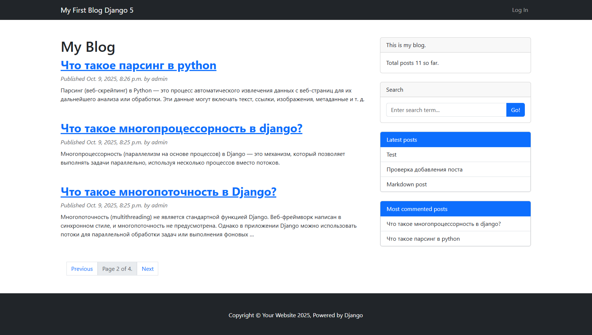

# Blog

Это веб-приложение на Django для ведения блога. Можно размещать свои посты, писать комментарии, работать с тегами, осуществлять поиск, также присутствует аутентификация через Google и GitHub, работа с почтой и Bootstrap 5.

## Установка

1. Клонируй репозиторий: `git clone https://github.com/sergeybogatov194-dev/Blog.git`
2. Создай виртуальное окружение: `python -m venv venv`
3. Активируй: `source venv/bin/activate` (на Windows: `venv\Scripts\activate`)
4. Установи зависимости: `pip install -r requirements.txt`
5. Примени миграции: `python manage.py migrate`
6. Запусти сервер: `python manage.py runserver`

## Технологии
- Django [5.2.7]
- Python [3.12]
- PostgreSQL
- Bootstrap 5

## Скриншоты
