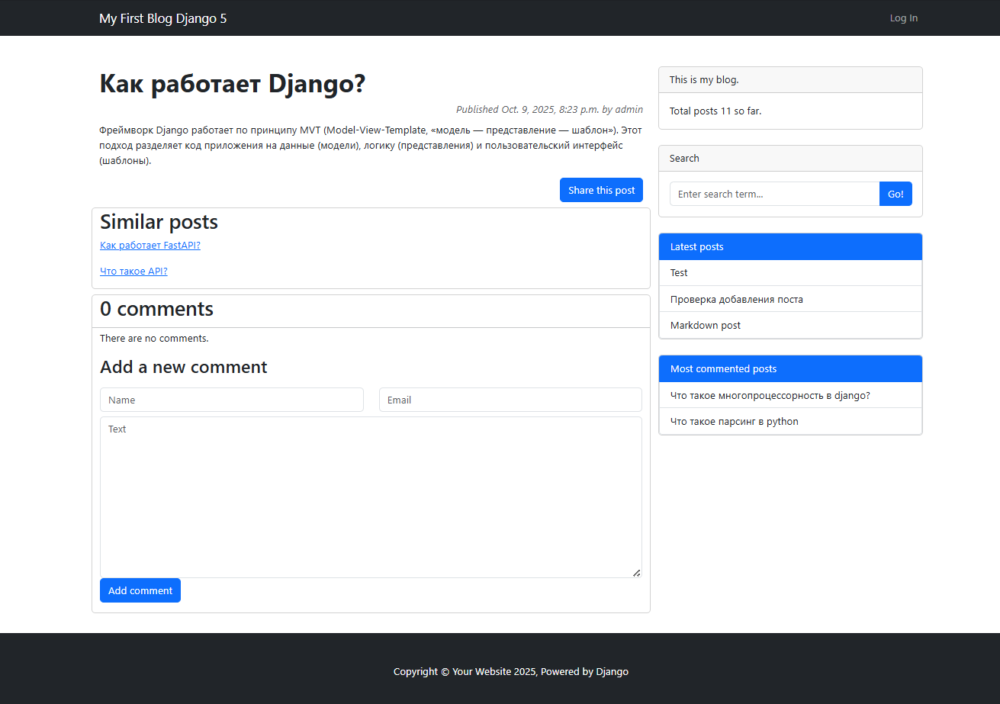
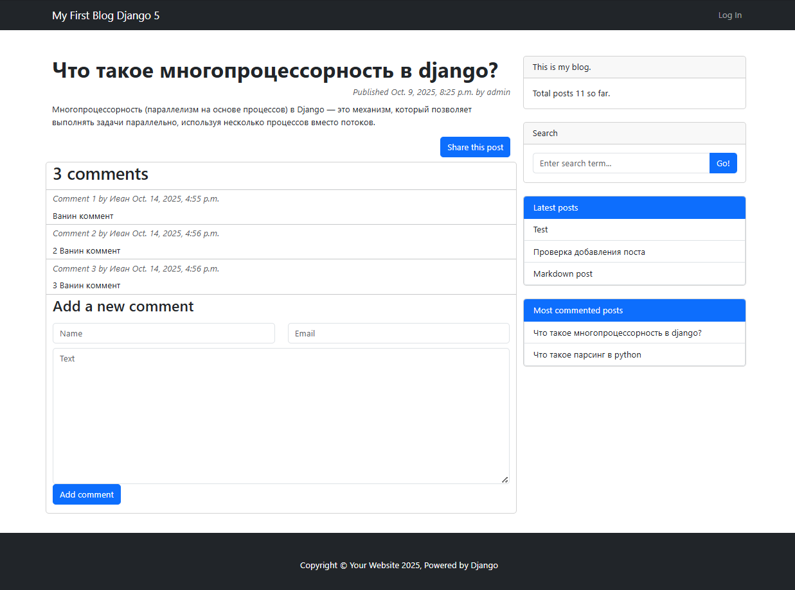

# 📝 Blog — веб-приложение для публикации и чтения постов

[](https://www.djangoproject.com/)
[](https://www.python.org/)
[](https://www.postgresql.org/)
[](https://getbootstrap.com/)

**Blog** — это современное веб-приложение для ведения личного блога, созданное на **Django**.  
Оно позволяет публиковать статьи, использовать теги, добавлять комментарии, искать посты и авторизоваться через Google или GitHub.  
Поддерживается работа с почтой и оформление с помощью **Bootstrap 5**.

---

## 📋 Содержание

- [Основной функционал](#-основной-функционал)
- [Стек технологий](#-стек-технологий)
- [Установка и запуск](#-установка-и-запуск)
- [Переменные окружения](#-переменные-окружения)
- [Скриншоты](#-скриншоты)
- [Roadmap](#-roadmap)

---

## ✨ Основной функционал

### 📰 Посты
- Публикация, редактирование и удаление постов (FBV — Function-Based Views)
- Детальная страница поста + пагинация списка

### 🏷 Теги
- Привязка тегов к постам  
- Быстрая фильтрация по тегу

### 💬 Комментарии
- Добавление комментариев к постам
- Базовая модерация (через админку Django)

### 🔍 Поиск
- Поиск по заголовку и содержимому постов

### 👤 Аутентификация
- Вход через **Google** и **GitHub** (OAuth)

### 📧 Почта
- Отправка писем (рекомендации постов и восстановление пароля) через SMTP

### 🎨 Интерфейс
- Оформление с использованием **Bootstrap 5**

---

## 🛠 Стек технологий

### Backend
- **Django 5.2.7** — основной фреймворк  
- **Python 3.12** — язык программирования  
- **PostgreSQL** — база данных  
- **Django ORM** — работа с БД  
- **Django Allauth** — OAuth авторизация  
- **SMTP** — интеграция с почтовыми сервисами  

### Frontend
- **Bootstrap 5** — интерфейс  
- **HTML5 / CSS3 / JavaScript** — клиентская часть  

### Инфраструктура
- **Virtualenv** — изоляция окружения  
- **Gunicorn/Nginx (опционально)** — деплой на сервере  

---

## 🚀 Установка и запуск

### 1. Клонирование репозитория
```bash
git clone https://github.com/sergeybogatov194-dev/Blog.git
cd Blog
```

### 2. Создание и активация виртуального окружения
```bash
python -m venv venv
source venv/bin/activate      # Windows: venv\Scripts\activate
```

### 3. Установка зависимостей
```bash
pip install -r requirements.txt
```

### 4. Создание и настройка файла `.env`
Создайте файл `.env` в корне проекта и добавьте в него следующие переменные окружения:

```bash
SECRET_KEY=your-django-secret-key
EMAIL_HOST_USER=your-email@gmail.com
EMAIL_HOST_PASSWORD=your-email-password
GITHUB_SECRET=your-github-client-secret
GOOGLE_KEY=your-google-client-id
GOOGLE_SECRET=your-google-client-secret
DB_NAME = your-db-name
DB_USER = your-db-user
DB_PASSWORD = your-db-password
DB_HOST = your-db-host
DB_PORT = your-db-port
```

> ⚠️ Не добавляйте `.env` в репозиторий — обязательно укажите его в `.gitignore`.

### 5. Применение миграций
```bash
python manage.py migrate
```

### 6. Запуск сервера разработки
```bash
python manage.py runserver
# Сервер запустится на http://127.0.0.1:8000
```

---

## 🌐 Переменные окружения

| Переменная              | Назначение                                                   |
|-------------------------|--------------------------------------------------------------|
| **SECRET_KEY**          | Секретный ключ Django (подпись cookies, токены, csrf и т.д.) |
| **EMAIL_HOST_USER**     | Email-аккаунт для отправки писем                             |
| **EMAIL_HOST_PASSWORD** | Пароль или App Password для этого email                      |
| **GITHUB_SECRET**       | Секретный ключ приложения GitHub OAuth                       |
| **GOOGLE_KEY**          | ID клиента Google OAuth                                      |
| **GOOGLE_SECRET**       | Секрет клиента Google OAuth                                  |
| **DB_NAME**             | Имя базы данных                                              |
| **DB_USER**             | Имя пользователя                                             |
| **DB_PASSWORD**         | Пароль для использования при подключении к базе данных       |
| **DB_HOST**             | Хост для подключения к базе данных                           |
| **DB_PORT**             | Порт для подключения к базе данных                           |

---

## 🖼 Скриншоты

| Главная страница | Пост | Комментарии |
|:----------------:|:----:|:------------:|
|  |  |  |

---